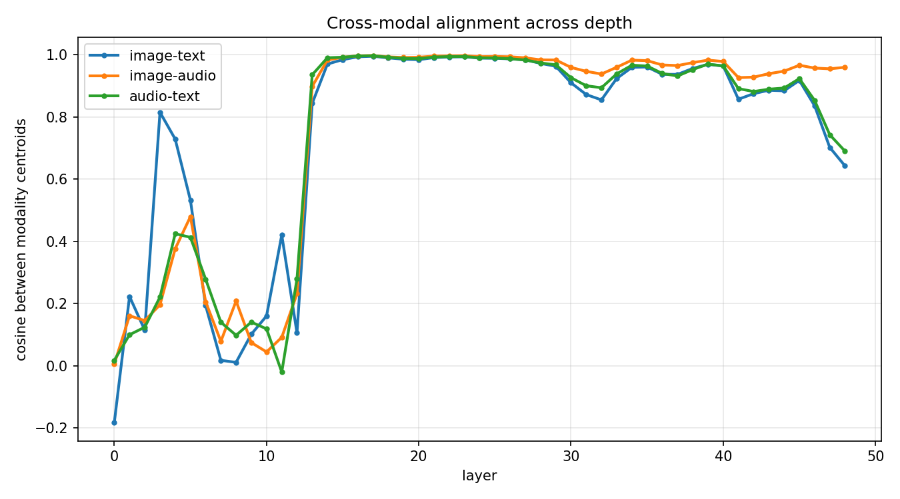
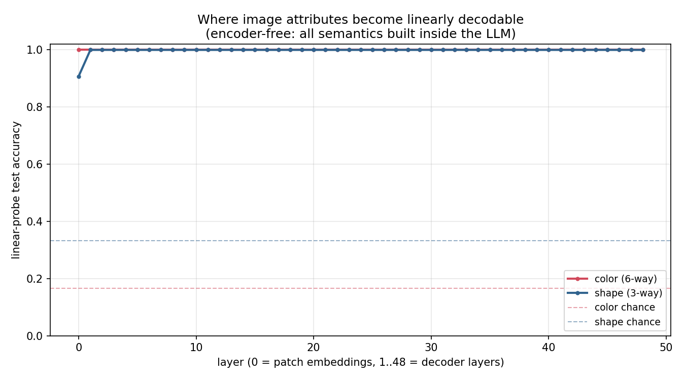
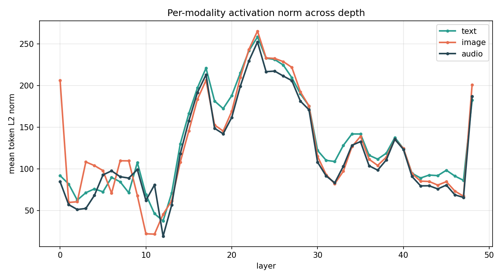
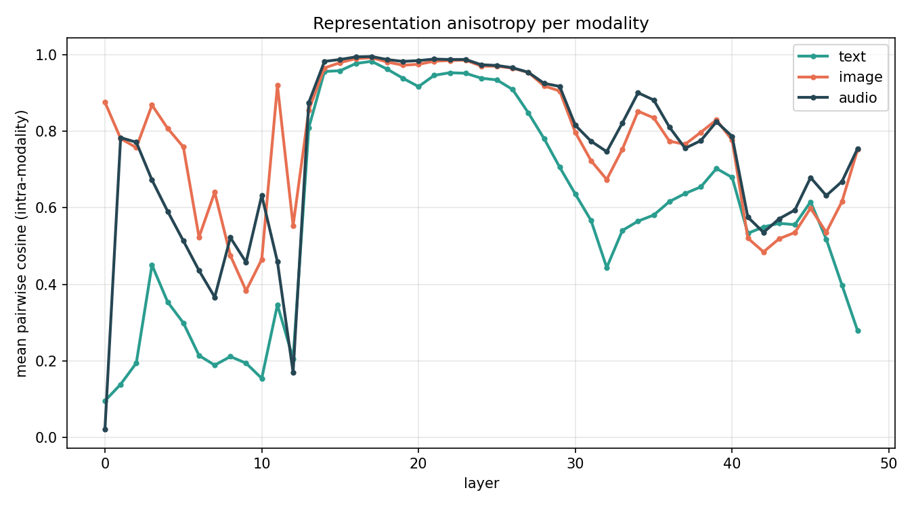
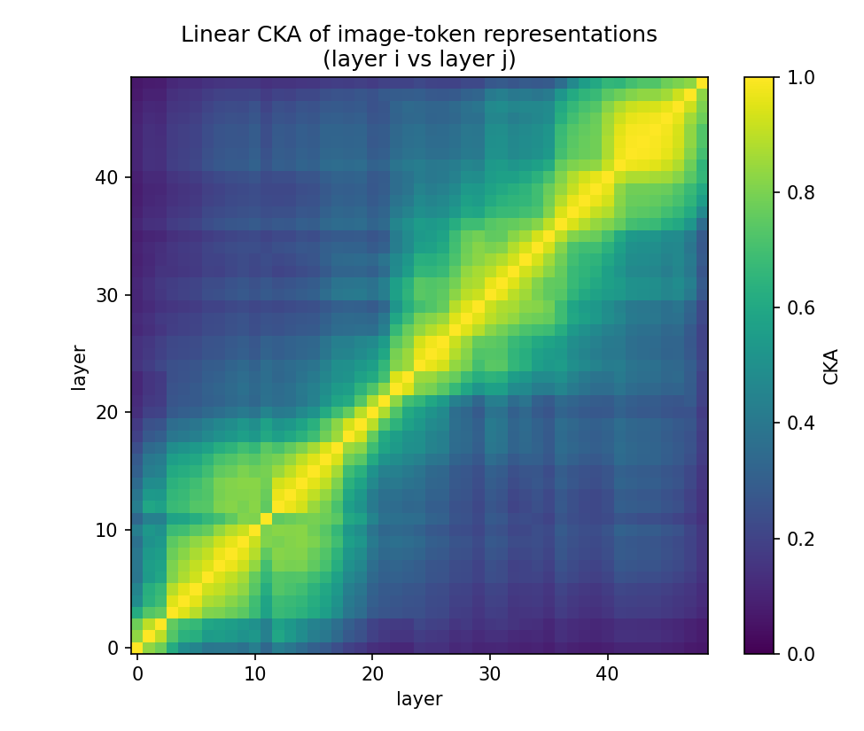

# Gemma 4 12B — Encoder-Free Multimodal Architecture Study

> A local, reproducible toolkit for understanding **how `google/gemma-4-12B-it` processes
> text, images, and audio *without any vision or audio encoder*** — built for a CVPR-track
> research project on encoder-free multimodal models.

<p align="center">
  <br>
  <em>Headline finding: image / audio / text tokens start in near-orthogonal subspaces,
  then snap into a shared representation around layer ~13.</em>
</p>

---

## TL;DR

- The 12B-it checkpoint is the **`gemma4_unified`** architecture (`Gemma4UnifiedForConditionalGeneration`) — **not** the encoder-bearing `gemma4` sibling that ships in the same library. *Study the right one.*
- **Encoder-free, verified by parameter count:** the entire image path is **49.9 M** params (0.42%) — a **35.2 M** patch embedder (the actual vision-encoder replacement, matching Google's "~35M") **+ a 14.7 M shared projection** into LM space — and the entire audio path is **2.46 M** params (0.02%). No attention, no convolutional encoder, no Conformer.
- Images → raw 48×48 pixel patches → `Linear` → soft tokens. Audio → raw 40 ms / 640-sample frames → a **single** `Linear` → soft tokens. Both are scattered into the **same** 48-layer decoder-only LLM.
- All experiments run on **one** RTX PRO 6000 (~24 GB in bf16), fully reproducible from synthetic inputs (no datasets to download).

---

## ⚠️ The two-implementations gotcha

`transformers` ships **two** Gemma 4 model types. They are easy to confuse:

| module | `model_type` | class | vision / audio |
|---|---|---|---|
| `gemma4` | `gemma4` | `Gemma4ForConditionalGeneration` | **has** a ViT vision encoder + Conformer audio encoder + MoE |
| **`gemma4_unified`** | **`gemma4_unified`** | **`Gemma4UnifiedForConditionalGeneration`** | **encoder-free, dense** |

`google/gemma-4-12B-it` is **`gemma4_unified`**. "Encoder-free" is a property of *this* class and
checkpoint config — the vision/audio configs contain **no** `num_hidden_layers` and **no** attention fields.

---

## Architecture at a glance

```
                            ┌──────────────────────────────────────────────┐
   IMAGE (any res)          │  Gemma4UnifiedVisionEmbedder  (49.9M, NO attn) │
   ──16px patch ─ 3×3 pool─►│  LN → Linear(6912→3840) → LN                   │
       =48×48 model-patch   │     → +factorized 2D pos-emb(1120,2,3840) → LN │──┐
       (6912 raw values)    │     → RMSNorm → Linear(3840→3840)              │  │
                            └──────────────────────────────────────────────┘  │  280 soft
                                                                               │  tokens
   AUDIO (16kHz)            ┌──────────────────────────────────────────────┐  │
   ──40ms / 640 samples────►│  Gemma4UnifiedMultimodalEmbedder (2.46M)       │  │  1 token /
       per frame            │  RMSNorm → Linear(640→3840)                    │──┤  40 ms
                            └──────────────────────────────────────────────┘  │
                                                                               ▼
   TEXT ──tokenizer──► scaled word-emb(×√3840) ──────────────────► [ masked_scatter into seq ]
                                                                               │
                                                                               ▼
                            ┌──────────────────────────────────────────────┐
                            │   DECODER-ONLY LLM  (11.91B, 48 layers)        │
                            │   hidden 3840 · GQA 16q/8kv · 256K ctx         │
                            │   40 sliding(win 1024) + 8 global  (5:1)       │
                            │   p-RoPE on global · QK-norm · K=V on global   │
                            └──────────────────────────────────────────────┘
                                                                               │
                                                                               ▼
                                                                    lm_head → 262,144 vocab
```

### Parameter budget (measured)

| Component | Params | Share |
|---|---:|---:|
| `language_model` (decoder-only LLM) | 11.91 B | 99.56 % |
| `embed_vision` (image path) | 49.9 M | 0.42 % |
| &nbsp;&nbsp;↳ patch embedder *(encoder replacement — Google's "~35M")* | 35.2 M | |
| &nbsp;&nbsp;↳ shared projection into LM space *(same module class as audio)* | 14.7 M | |
| `embed_audio` (audio path) | 2.46 M | 0.02 % |
| **Total** | **11.96 B** | 100 % |

> **Why 35M vs 49.9M?** Google's "~35M vision embedder" counts only the *patch embedder*
> (LayerNorm + Dense + factorized positional embedding) that replaces the vision encoder.
> The full `embed_vision` module (49.9M) also includes a generic `RMSNorm → Linear(3840→3840)`
> projection into LM space (14.7M) — the *same* `Gemma4UnifiedMultimodalEmbedder` the audio path
> uses as its whole pipeline. So **49.9M = 35.2M (vision-specific) + 14.7M (shared projection)**.

### LLM internals
- 48 layers, hidden 3840, intermediate 15360, vocab 262 144, context 262 144 (256K).
- **GQA**: 16 query / 8 KV heads. `head_dim` 256 (sliding) / 512 (global).
- **Hybrid attention**: 40 `sliding_attention` (window 1024) + 8 `full_attention`, pattern **5:1**, last layer forced global.
- **p-RoPE**: global layers use proportional RoPE (`partial_rotary_factor=0.25`, θ=1e6); sliding layers default RoPE (θ=1e4).
- **QK-norm** (per-head RMSNorm on Q/K/V) and **K=V sharing** on global layers (`attention_k_eq_v`).
- Gemma-style **4-norm sandwich** decoder layer + per-layer `layer_scalar`.
- Dense (no MoE in this checkpoint).

---

## What the analyses found

### 1. Where image attributes become linearly decodable
<p align="center"></p>

Linear probes on mean-pooled image soft tokens: **color is perfectly decodable already at layer 0**
(the raw linear patch projection), while **shape** needs a few LLM layers to fully form. With no
encoder, low-level attributes are linearly present at the embedder; spatial structure is assembled
by the early decoder layers. *(Synthetic task → ceiling effect; see the report for caveats.)*

### 2. Cross-modal alignment — a phase transition (~layer 13)
<p align="center"></p>

Modality centroids are **near-orthogonal in the first ~12 layers**, then **snap to ~0.99 cosine** and
stay aligned through the mid-stack — the model fuses modalities into a **shared subspace**. Near the
output, image↔text re-diverges while image↔audio stays bound.

### 3. Activation norm & the mid-stack bottleneck
<p align="center"></p>

Per-modality token norms dip to a minimum around **layer 11–12** (the alignment pivot), then peak
sharply near **layer 23** (massive-activation / outlier regime), for all three modalities together.

### 4. Anisotropy & representational evolution (CKA)
<p align="center">
  
  
</p>

At the mid-stack peak, intra-modality cosine reaches ~0.94–0.97 (near-collapse to a shared
direction). Layer-vs-layer CKA of image tokens is high only locally (adjacent ≈0.93) and
`CKA(L0,L48)≈0.07` — representations are fully transformed from input to output.

---

## Setup

Built and verified on 3× NVIDIA RTX PRO 6000 Blackwell (`sm_120`), CUDA 13 driver. The model fits on
one GPU in bf16 (~24 GB).

```bash
uv venv --python 3.12 .venv
VIRTUAL_ENV=.venv uv pip install torch torchvision torchaudio --index-url https://download.pytorch.org/whl/cu128
VIRTUAL_ENV=.venv uv pip install -r requirements-lock.txt   # exact pinned versions
# weights (ungated, Apache-2.0):
.venv/bin/hf download google/gemma-4-12B-it --local-dir ./models/gemma-4-12B-it
```

## Run

```bash
.venv/bin/python scripts/01_architecture_report.py      # static report (no weights needed)
.venv/bin/python scripts/02_modality_trace.py           # per-layer / per-modality shapes
.venv/bin/python scripts/03_linear_probes.py            # where semantics emerge
.venv/bin/python scripts/04_representation_geometry.py  # norms, anisotropy, CKA, cross-modal
.venv/bin/python scripts/05_build_report.py             # assemble the PDF report
```

## Repo layout

```
scripts/   01..05 analysis + report tools, _common.py helpers
notes/     architecture_report.md, encoder_free_architecture.md
outputs/   figures/*.png, *.json traces, Gemma4_EncoderFree_Report.pdf
models/    downloaded checkpoint (gitignored)
requirements-lock.txt   pinned environment
```

## Findings report

A self-contained PDF write-up of everything above is at
**`outputs/Gemma4_EncoderFree_Report.pdf`** (generated by `scripts/05_build_report.py`).

---

*Model: `google/gemma-4-12B-it` (Apache-2.0). This repo is independent research tooling.*
